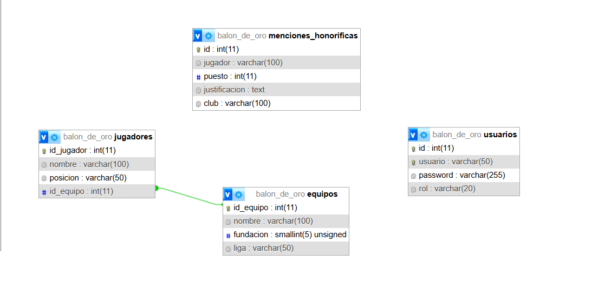

## BalonDeOro-Web2

## Temática: Balón de Oro
Proyecto basado en el Balón de Oro 2025 que permite gestionar jugadores, equipos y menciones honoríficas. Incluye vistas con CRUD completo, login seguro para acciones protegidas y una API REST para consultar y manipular menciones con filtros, ordenamiento y paginación.

## Correcciones Aplicadas (Parte 2)
• Se agregó detalle de mención.
• Se agregó columna "club" en formularios y vistas.
• Se protegieron las acciones con login obligatorio.
• Se corrigieron rutas y BASE_URL.
• Se implementó password_hash + password_verify (no hardcodeado).

## Parte 3 – API REST
API implementada sobre "menciones honoríficas".

Rutas Principales:
• GET /api/menciones
• GET /api/menciones/{id}
• POST /api/menciones
• PUT /api/menciones/{id}
• DELETE /api/menciones/{id}

Opcionales Implementados:
• Ordenamiento (?orden=puesto)
• Paginación (?page=1&limit=5)
• Filtros (?search=Messi, ?club=Barcelona, etc.)

## Instalación
1. Clonar repositorio en carpeta "htdocs" de XAMPP.
2. Importar la base desde balon_de_oro.sql o dejar que se autogenere.
3. Iniciar Apache y MySQL.
4. Acceder a http://localhost/BalonDeOro-Web2/

## Acceso administrador
Usuario: webadmin  
Contraseña: admin

## Integrante:
Leonel Casamayou - leonelcasamayou@gmail.com

## Diagrama Entidad-Relación

